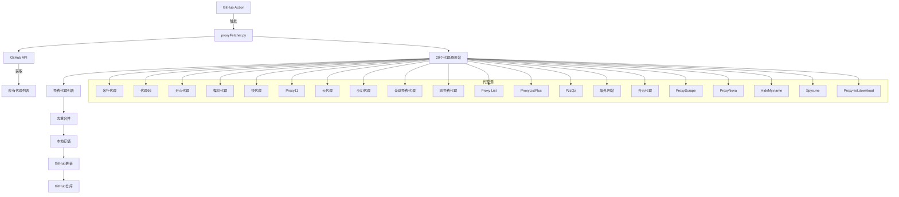
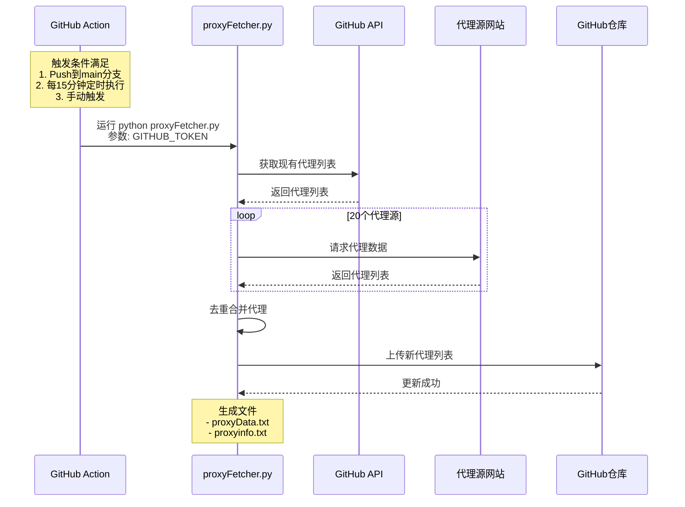
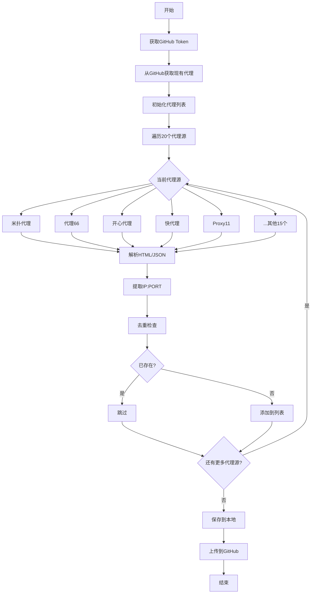

[](https://github.com/parserpp/parser_proxy_poll/actions/workflows/python-package.yml)

# 代理池系统 (Proxy Pool System)

一个稳定的代理池系统，自动获取、验证和管理免费代理，并同步到GitHub。

## 系统架构



## GitHub Action 触发流程



## 代理获取流程



## 主要特性

### ✅ 自动获取
- **20个代理源**: 覆盖国内外主要免费代理网站
- **智能解析**: 自动识别和解析HTML、JSON等格式
- **API支持**: 支持API接口和网页抓取两种方式
- **去重合并**: 自动去除重复代理，合并新旧数据

### 🔍 多级验证
- **多URL检测**: 支持4个不同的检测URL
- **多种检测模式**:
  - 基础检测: 快速检测一个URL
  - 快速检测: 使用 httpbin.org/ip
  - 多URL检测: 检测多个URL，至少一半通过
  - 严格检测: 所有URL都必须通过
  - 带重试检测: 支持多次重试

### 🔄 持续更新
- **GitHub Action**: 自动触发更新
  - Push到main分支时触发
  - 每15分钟定时执行
  - 支持手动触发
- **自动同步**: 自动上传到GitHub仓库
- **本地备份**: 同时保存到本地文件

## 安装依赖

```bash
pip install -r requirements.txt
```

## 快速开始

### 1. 手动运行

```bash
# 运行主程序
python proxyFetcher.py [GITHUB_TOKEN]

# 或设置环境变量
export GITHUB_TOKEN=your_token_here
python proxyFetcher.py
```

### 2. 测试代理获取功能

```bash
# 测试单个代理源
python -c "from proxyFetcher import freeProxy05; import itertools; print(list(itertools.islice(freeProxy05(), 10)))"

# 测试代理检测
python check_proxy.py
```

### 3. 测试新功能（可选）

```bash
# 使用异步获取器
python optimized_fetcher.py

# 使用代理管理器
python proxy_manager.py [GITHUB_TOKEN]

# 查看演示
python demo.py
```

## 目录结构

```
parser_proxy_1/
├── proxyFetcher.py          # ⭐ 主程序（原始结构）
├── check_proxy.py           # ⭐ 代理检测（增强版）
├── webRequest.py            # ⭐ 网络请求（原始）
├── github_api.py            # ⭐ GitHub API操作（原始）
├── proxyData.txt            # 本地代理数据
├── requirements.txt         # 依赖包
├── README.md                # 说明文档
└── .github/
    └── workflows/
        └── python-package.yml  # GitHub Action配置
```

## 代理源网站列表

| 编号 | 名称 | 类型 | 描述 |
|------|------|------|------|
| 01 | 米扑代理 | 网页 | 多种类型代理 |
| 02 | 代理66 | API | HTTP代理列表 |
| 03 | 开心代理 | 网页 | 高匿和普通代理 |
| 04 | 蝶鸟代理 | 网页 | 免费代理列表 |
| 05 | 快代理 | 网页 | 高质量HTTP代理 |
| 06 | Proxy11 | API | Demo API代理 |
| 07 | 云代理 | 网页 | 免费HTTP代理 |
| 08 | 小幻代理 | 网页 | 有提取API |
| 09 | 全球免费代理 | 网页 | 全球代理库 |
| 10 | 89免费代理 | 网页 | 免费代理列表 |
| 11 | Proxy List | 网页+Base64 | Base64编码代理 |
| 12 | ProxyListPlus | 网页 | Fresh HTTP代理 |
| 13 | PzzQz | API | 动态生成代理 |
| 14 | 墙外网站 | 网页 | CN代理列表 |
| 15 | 齐云代理 | 网页 | 中国代理 |
| 16 | ProxyScrape | API | 大量HTTP代理 |
| 17 | ProxyNova | 网页 | 代理列表 |
| 18 | HideMy.name | 网页 | 匿名代理 |
| 19 | Spys.me | 文本 | 长期稳定代理 |
| 20 | Proxy-list.download | API | 定期更新列表 |

## 代理检测方法

### 检测URL
- `http://icanhazip.com/` - 获取当前IP
- `http://httpbin.org/ip` - JSON格式IP信息
- `http://ipinfo.io/ip` - IP信息
- `http://httpbin.org/get` - 详细请求信息

### 检测模式

```python
from check_proxy import check_proxy

# 基础检测（默认）
check_proxy("1.2.3.4:8080", method='basic')

# 快速检测
check_proxy("1.2.3.4:8080", method='fast')

# 多URL检测
check_proxy("1.2.3.4:8080", method='multiple')

# 严格检测
check_proxy("1.2.3.4:8080", method='strict')

# 带重试检测
from check_proxy import check_proxy_with_retry
check_proxy_with_retry("1.2.3.4:8080", retry_times=3)
```

## 输出文件

### 本地文件
- `proxyData.txt` - 代理列表（追加模式）

### GitHub仓库
- https://github.com/parserpp/ip_ports/blob/main/proxyinfo.txt

## GitHub Action 配置

### 触发条件
1. **Push到main分支**: 代码更新时自动运行
2. **定时执行**: 每15分钟 (`*/15 * * * *`)
3. **手动触发**: 通过GitHub界面手动运行

### 运行步骤
```yaml
1. 安装Python 3.10
2. 安装依赖包
3. 运行 python proxyFetcher.py ${{ secrets.GTOKEN }}
4. 上传结果到GitHub
```

### 配置密钥
在GitHub仓库设置中添加：
- **名称**: `GTOKEN`
- **值**: 你的GitHub Personal Access Token

## 环境变量

- `GITHUB_TOKEN`: GitHub访问令牌（必需）
- `PYTHONPATH`: Python模块搜索路径

## 使用示例

### 读取代理列表

```python
# 从GitHub获取
import github_api
token = "your_github_token"
content = github_api.get_content("parserpp", "ip_ports", "/proxyinfo.txt", token)
proxies = content.split("\n")

# 从本地文件读取
with open('proxyData.txt', 'r') as f:
    proxies = [line.strip() for line in f if line.strip()]

# 使用代理
import requests
proxy = proxies[0]
proxies_dict = {
    'http': f'http://{proxy}',
    'https': f'https://{proxy}'
}
response = requests.get('http://httpbin.org/ip', proxies=proxies_dict)
print(response.json())
```

### 批量检测代理

```python
from check_proxy import batch_check_proxies

proxies = ["1.2.3.4:8080", "5.6.7.8:3128", "9.10.11.12:80"]
results = batch_check_proxies(proxies, check_method='fast', max_workers=5)

for proxy, is_valid in results:
    print(f"{proxy}: {'✓' if is_valid else '✗'}")
```

## 注意事项

1. **GitHub Token**: 必须配置有效的GitHub访问令牌
2. **网络连接**: 需要稳定的网络连接访问代理源
3. **请求频率**: 避免过于频繁的请求，可能被网站封禁
4. **免费代理**: 免费代理不稳定，建议及时更新
5. **代理格式**: 统一使用 `IP:PORT` 格式

## 故障排除

### 常见问题

**Q: GitHub Action运行失败？**
A: 检查 `GITHUB_TOKEN` 是否正确配置，确保有仓库访问权限

**Q: 获取不到代理？**
A: 检查网络连接，确认代理源网站可访问

**Q: 上传GitHub失败？**
A: 检查GitHub token权限，确保有 `repo` 权限

**Q: 代理验证失败？**
A: 正常现象，免费代理不稳定，系统会自动过滤

## 更新日志

### v1.5.0 (2024-12-12)
- ✨ 新增5个代理源 (ProxyScrape, ProxyNova, HideMy.name, Spys.me, Proxy-list.download)
- ✨ 增强代理检测功能，支持4种检测模式
- ✨ 添加批量检测和多URL验证
- ✨ 优化错误处理和重试机制
- 🔧 修复多个代理源网站的解析规则
- 📝 更新文档，添加架构图和流程图

### v1.0.0 (原始版本)
- ✅ 15个代理源
- ✅ GitHub同步
- ✅ GitHub Action自动运行
- ✅ 基础代理检测

## 许可证

MIT License

## 贡献

欢迎提交Issue和Pull Request！

## 联系方式

如有问题，请通过GitHub Issues联系。
